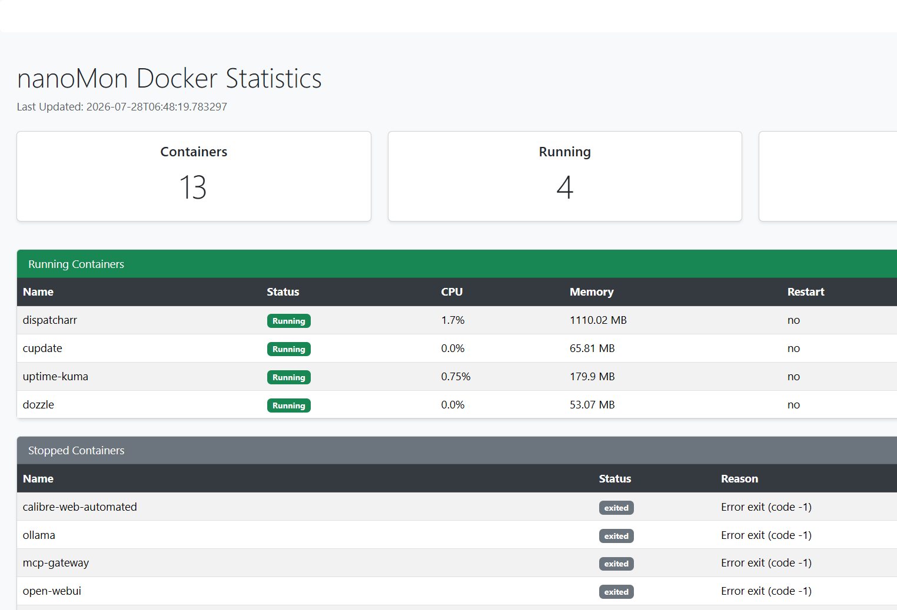

# nanoMon

## Overview

nanoMon is a lightweight Docker monitoring dashboard written in Python.

It is intended to provide a quick snapshot of Docker containers without the complexity of full monitoring platforms such as Grafana or Prometheus.



The dashboard displays:

* Total container count
* Running container count
* Stopped container count
* Running container CPU usage
* Running container memory usage
* Restart policy
* Container uptime
* Stopped container exit reason

The interface is intentionally simple and designed for personal Docker servers.

## Requirements

* Python 3.13 or newer
* Docker Desktop or Docker Engine
* Flask

## Installation

Install Flask:

```
pip install flask
```

Run the application:

```
python index.py
```

Open a web browser and navigate to:

```
http://127.0.0.1:5000
```

## Project Structure

statistics.py
Collects Docker information.

display.py
Converts raw Docker data into display-ready structures.

index.py
Flask web application.

templates/dashboard.html
Dashboard page.

static/nanomon.js
JavaScript used to retrieve dashboard data and update the page.

## How It Works

1. The browser loads the dashboard page.
2. JavaScript requests current Docker statistics.
3. Flask calls statistics.py.
4. statistics.py gathers Docker information.
5. display.py prepares the data for presentation.
6. JSON is returned to the browser.
7. JavaScript updates the dashboard without reloading the page.

## Design Goals

* Simple architecture
* Small codebase
* Fast startup
* No historical database
* No background agents
* Easy to modify
* Easy to extend

## Current Features

* Live Docker container statistics
* Background data loading
* Bootstrap-based interface
* Exit reason reporting
* Responsive layout

## Future Ideas

* Manual refresh button
* Automatic refresh interval
* Host CPU and memory statistics
* Disk usage
* Docker image statistics
* Container health indicators
* Optional historical logging

## License

Choose the license that best matches your intended distribution.

## Author

Craig Rosenblum
